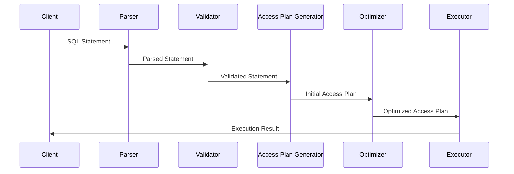

Year 2023, September, Week 35

## Algorithm

[Lay Carpets](https://www.luogu.com.cn/problem/P1003)

**Idea**: Enumerate the carpets in reverse order (because the carpets laid later may overlay on top, and the question requires obtaining the ones underneath). As soon as a carpet meets the condition, output it directly.

**Note**: A trick here is to enumerate carpets in reverse order, which will me much quicker. Because the first carpet that includes the point necessarily at the top.

```c++
#include<iostream>
#include<cstdio>
using namespace std;
const int MAXN = 10000 + 5;
int n;
int a[MAXN],b[MAXN],x[MAXN],y[MAXN];
int sx,sy;
int main() {
    scanf("%d", &n);
    for(int i = 1; i <= n; ++i) {
        scanf("%d %d %d %d", &a[i], &b[i], &x[i], &y[i]);
    }
    scanf("%d %d", &sx, &sy);

    int ans = -1;
    for(int i = n; i >= 1; --i) {
        if(sx >= a[i] && sx <= a[i] + x[i] && sy >= b[i] && sy <= b[i] + y[i]) {
            ans = i;
            break;
        }
    }
    printf("%d\n", ans);

    return 0;
}
```

- Time complexity: $O(n)$

- Space complexity: $O(1)$

[Spiral Matrix II](https://leetcode.com/problems/spiral-matrix-ii/)

**Idea**: Solve with brute force

```java
public int[][] generateMatrix(int n) {
    int num[][] = new int[n][n];
    int count = 1;
    int top = 0, left = 0, bottom = n -1, right = n - 1;
    while (count <= n * n) {
        // fill the top row
        for (int i = left; i <= right; ++i) {
            num[top][i] = count++;
        }
        top++;
        // fill the rightmost column
        for (int i = top; i <= bottom; ++i) {
            num[i][right] = count++;
        }
        right--;
        // fill the bottom row
        for (int i = right; i >= left; --i) {
            num[bottom][i] = count++;
        }
        bottom--;
        // fill the leftmost row
        for (int i = bottom; i >= top; --i) {
            num[i][left] = count++;
        }
        left++;
    }
    return num;
}
```

- Time complexity: $O(n^2)$

- Space complexity: $O(n^2)$

## Review

### SQL in depth

[Levels of SQL understanding (in PostgreSQL)](https://avestura.dev/blog/explaining-the-postgres-meme)

### Big O Notation

[What is Big O Notation Explained: Space and Time Complexity](https://www.freecodecamp.org/news/big-o-notation-why-it-matters-and-why-it-doesnt-1674cfa8a23c/)

Big $O$ notation **complexity rank**: factorials > exponentials > polynomials > logarithms > constant time

<div style="clear:both"></div>

## Share

**How does a SQL query works?**

To process an SQL statement, a DBMS performs the following five steps[^1][^2]:

1. The DBMS first **parses the SQL statement**.

   During parsing, the SQL statement is transformed into a database-internal representation, called the *syntax tree*. Syntax errors and misspellings can be detected in this step.

2. The DBMS **validates the statement**.

   It checks the statement against the system catalog. Do all the tables named in the statement exist in the database? Do all of the columns exist and are the column names unambiguous? Does the user have the required privileges to execute the statement? Certain semantic errors can be detected in this step.

3. The DBMS **generates an access plan for the statement**.

   The access plan is a binary representation of the steps that are required to carry out the statement; it is the DBMS equivalent of executable code.

4. The DBMS **optimizes the access plan**.

   It explores various ways to carry out the access plan. Can an index be used to speed a search? Should the DBMS first apply a search condition to Table A and then join it to Table B, or should it begin with the join and use the search condition afterward? Can a sequential search through a table be avoided or reduced to a subset of the table? After exploring the alternatives, the DBMS chooses one of them.

5. The DBMS **executes the statement by running the access plan**.



SQL execution order[^3]:

FROM -> WHERE -> GROUP BY -> HAVING -> SELECT -> DISTINCT -> ORDER BY -> LIMIT

SQL query mainly works in three phases:

1. Row filtering: filter rows by `FROM`, `WHERE`, `GROUP BY`, `HAVING` clause
2. Column filtering: columns are filtered by `SELECT` clause
3. Row filtering: filter rows by `DISTINCT`, `ORDER BY`, `LIMIT` clause

## Thoughts

I am seeking intern these days. I found that understanding the basics and principles of the JVM, Spring Framework, Redis... is important when interviewing for big tech companies. Moreover, it's crucial to have a thorough understanding of my own project and to articulate it effectively during interviews.

Initially, I hesitated to seek an internship, believing I lacked sufficient knowledge. However, I now realize that internships are a crucial component of a well-rounded resume when searching for a formal job. No matter how much i have learnt, just try to find an internship, there'll always be an suitable job for me.

[^1]: https://learn.microsoft.com/en-us/sql/odbc/reference/processing-a-sql-statement

[^2]: https://vladmihalcea.com/relational-database-sql-prepared-statements/

[^3]: https://stackoverflow.com/a/67148174/14673626
